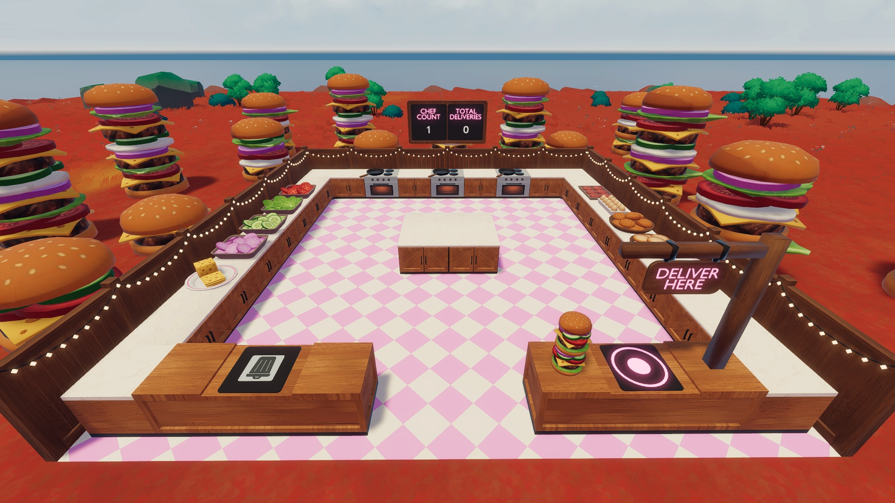

# Kitchen Chaos

A co-op cooking game for Decentraland, built on SDK7 with an authoritative multiplayer server.

Team up to grab ingredients, cook them, assemble orders and get them to the pass before the timer runs out — and don't
leave anything on the stove too long, or it'll burn.

Orders arrive in a shared queue that grows with the number of players. Delivering builds a kitchen-wide streak that
unlocks harder, better-paying recipes, and misses knock it back. Coins go to everyone who helped and stack up
permanently on an in-world leaderboard. Every session starts fresh when the first player joins and ends shortly after
the last one leaves.

Created for the Regenesis Labs Buildathon.



---

## Gameplay

### The loop

1. **Grab** an ingredient from one of the counters along the walls.
2. **Cook** it if it needs cooking — put it on a stove, wait, collect it before it burns.
3. **Assemble** the order by stacking ingredients onto a preparation counter, bottom to top.
4. **Deliver** the finished stack at the delivery counter.

Everyone in the scene is a chef. There are no roles and no permissions — walk in and start cooking.

### Orders

Orders appear in the HUD queue, each with an ingredient stack and a draining timer. The queue holds **one more order
than there are players**, capped at six, so there's always a choice to make and a solo player is never stuck on a single
order.

An order that runs out of time shows a **Timed out!** card for a couple of seconds before it's replaced. A correct
delivery shows **Success!** and who delivered it. A wrong stack is rejected.

### Streak and levels

The kitchen has a shared streak that drives a difficulty level from **1 to 5**:

| Event            | Streak |
| ---------------- | ------ |
| Correct delivery | +2     |
| Wrong delivery   | −1     |
| Order times out  | −1     |

Every 7 streak promotes a level, so the top tier lands after about 14 clean deliveries. Higher levels unlock longer,
more complex recipes worth more coins. The streak keeps climbing past the top tier's threshold, so a good run can absorb
a few mistakes before demoting.

### Coins and the leaderboard

A delivery pays its recipe's full coin value to **every player who has acted in the last 3 minutes** — not just whoever
carried the plate. Fetching and cooking is the real work; the last step shouldn't take the whole reward.

Coin totals are permanent, saved per wallet, and rank the top 10 on the in-world leaderboard — which includes players
who aren't currently in the scene.

### Sessions

Play is session-based. A session **starts clean the moment someone walks into an empty scene**: level back to 1, no
orders carried over, counters and stoves emptied, hands emptied.

A session **ends 30 seconds after the last player leaves**. The grace period means stepping outside for a moment doesn't
wipe your run — though the kitchen keeps running while you're gone, so orders can still expire and a pan can still burn.

A player joining a session in progress resets nothing. They join a service already underway.

Coins and the leaderboard are the only things that survive a session boundary.

---

## The kitchen

The scene is a 2×2 parcel room (32m × 32m). Every interactive fixture highlights when you look at it, and tells you why
an action isn't allowed if you try it anyway.

| Fixture                 | Count | What it does                                                             |
| ----------------------- | ----- | ------------------------------------------------------------------------ |
| **Ingredient counter**  | 10    | Take an endless supply of one ingredient.                                |
| **Preparation counter** | 14    | Stack ingredients bottom to top; pick the whole stack back up.           |
| **Stove**               | 3     | Cook a raw ingredient. Shows a progress bar, then a checkmark when done. |
| **Delivery counter**    | 1     | Hand in a finished stack. Checkmark for a match, cross for a miss.       |
| **Discard counter**     | 1     | Bin whatever you're holding.                                             |

Preparation counters line both side walls, alternate with the stoves along the front row, and form a 2×3 island in the
middle of the room. The delivery and discard counters sit on the back wall by the entrance.

Picking up from a preparation counter takes the **whole stack**, not just the top item.

---

## Ingredients

Ten ingredients, two of which need cooking.

| Ingredient   | Type         | Wall  |
| ------------ | ------------ | ----- |
| Plate        | Non-cookable | Right |
| Bun (bottom) | Non-cookable | Right |
| Bun (top)    | Non-cookable | Right |
| Cheese       | Non-cookable | Left  |
| Tomato       | Non-cookable | Left  |
| Cucumber     | Non-cookable | Left  |
| Onion        | Non-cookable | Left  |
| Salad        | Non-cookable | Left  |
| Patty        | **Cookable** | Right |
| Egg          | **Cookable** | Right |

### Cooking

A cookable ingredient takes **5 seconds** on a stove. After it finishes you have a **10 second grace period** to collect
it — past that it comes off burnt, and a burnt item matches no recipe. The stove shows a progress bar while cooking and
a checkmark once it's ready.

Collecting from a stove is the one action a client never renders optimistically. It hands out a scarce item, so it waits
for the server to say who won the race rather than guessing — two players racing the same finished stove can't both walk
away with it.

---

## Recipes

45 recipes across the 5 difficulty tiers, 9 per tier. Tier 1 is three or four ingredients with at most one cooked item;
tier 5 runs to eight ingredients with repeats. Timers scale with length, from 24 to 105 seconds.

Coin payouts follow a fixed scale, from 9 to 50:

```
coins = 3 × ingredients + 7 × cooked items + 2 × (difficulty − 1)
```

Three per ingredient is one grab and one place. A cookable is worth roughly triple, since it also costs a stove trip, a
wait and a collect. The difficulty term only stops the tiers inverting — a long salad is genuinely less work than a
short burger with a patty, and the payout says so.

The streak is deliberately **not** multiplied into the payout. It already raises pay by unlocking higher-difficulty
recipes.

---

## Mobile and desktop

The buildathon targeted mobile, but the goal was a scene that plays properly on both. Every platform difference is an
explicit branch rather than one layout that happens to fit twice.

- **The platform is resolved before anything is drawn.** A scene cannot tell which platform it is on for the first
  moments after it starts, so anything built immediately would silently bake in desktop values. The HUD, the stove
  visuals and the camera all wait for the answer.

- **Interaction is proximity-based, and it shows you so.** Walking up to a counter focuses it — the nearest one in range
  wins, and which way you are facing only breaks ties between two that are almost equally close, enough to settle a
  corner without ever needing to aim. A highlight on top of the focused fixture turns green when the action is allowed
  and grey when it is not. On a touchscreen this matters more than on desktop: the player walks up to things instead of
  aiming at them.

- **Mobile locks the camera inside the kitchen.** On a phone, looking around means dragging with the thumb that is
  already steering. Mobile instead gets a fixed, slightly overhead camera that follows the player without rotating;
  stepping out of the kitchen hands the normal camera back. Desktop keeps free look, where a mouse costs nothing.

- **The on-screen buttons the game never uses are removed.** Decentraland's mobile HUD ships eight gamepad buttons and
  this scene uses one, so the other seven are hidden — a single unambiguous action button instead of a pad where most of
  it does nothing.

- **The HUD is a separate design, not a scaled one.** Mobile runs on a narrower virtual canvas, so the same values do
  not simply scale up. The order queue moves to the bottom of the screen, since the middle of a phone is the player's
  own view; text is larger and bold; the panels sit flush to the corner.

- **World-space visuals rotated facing camera.** On desktop, floating labels turn to face a camera that orbits; on
  mobile the camera never rotates, so they take a fixed facing instead.

- **Two limits are worth naming.** The camera eases in when you enter the kitchen but cuts instantly when you leave —
  the SDK has no exit transition. And the background music is desktop-only: it would not play reliably on mobile, so
  rather than ship something broken it simply is not started there.

---

## Running it locally

Requires Node 22+.

```bash
npm install
npm start
```

That opens the scene in the local preview with the authoritative server running alongside it.

### Testing multiplayer

Session boundaries, the queue growing with the player count, and a delivery paying everyone who helped all need more
than one client. The preview can supply them three ways:

- `npm start -- --bevy-web` opens the preview in the Bevy web client rather than the desktop Explorer. Each browser tab
  is its own player, so two or three chefs cost two or three tabs. On Chromium 142+ the page asks for Local Network
  Access the first time — allow it, or it cannot reach the preview server.
- `npm start -- --mobile` serves a QR code for a phone on the same network. The only way to check the mobile HUD, the
  locked camera and the single action button against a real device.
- `npm start -- --multi-instance` permits more than one desktop Explorer at a time.

Deploying to the World is still worth doing before judging anything by feel — real network latency only shows up there,
and it is where the optimistic hand updates and the server corrections actually get tested against each other.

---

## Deploying

This scene lives in a World, which needs an explicit content-server target:

```bash
npm run deploy -- --target-content https://worlds-content-server.decentraland.org
```

Plain `npm run deploy` goes to the default Catalyst, which is Genesis City LAND — not the World named in `scene.json`.

`predeploy` stamps a build label into `src/client/buildInfo.ts` first, so a deploy can be identified — deploys can lag
by several minutes, and a stale one is otherwise indistinguishable from a new one. The in-HUD readout of that label is
switched off by default (`SHOW_BUILD_LABEL` in `src/client/ui/buildLabel.tsx`, where it overlapped the mobile action
button); turn it on when a live build needs confirming.

> [!IMPORTANT] **`worldConfiguration.name` must be lowercase**, even if the minted NAME is mixed case
> (`kitchenchaos.dcl.eth`, not `KitchenChaos.dcl.eth`). The client resolves comms to the lowercase URL while the server
> registers under the name as written, so a mixed-case name puts them in different comms rooms and the scene hangs on
> "Loading..." forever. Player presence still resolves case-insensitively, so the server looks perfectly healthy while
> messaging is dead.

### Server logs

```bash
npm run server-logs
```

Reading production server logs requires a `logsPermissions` array in `scene.json` holding your wallet address.

### SDK version

> [!WARNING] Do not run `npm run upgrade-sdk` or `upgrade-sdk:next`. The `latest` and `next` SDK lineages have no
> authoritative-server support — the scene would build and then fail to talk to its server. This project is pinned to an
> `auth-server` build on purpose.

---

## Architecture

The scene is **server-authoritative**. A headless server runs alongside it and owns all game state; clients render that
state and send intents.

- **Clients send intent, never results.** `placeOnCounter`, `startCookingOnStove`, `deliverHeldItem` — never "here is
  the counter's new contents". Two clients computing "current state + my change" from the same stale snapshot is a
  lost-update race; the server applies each intent against the true latest state instead.
- **Every synced component is locked to the server.** `validateBeforeChange` rejects writes from anyone but the auth
  server, so a client can't write game state directly.
- **Clients derive time locally.** Order timers and cooking progress come from a synced start timestamp plus the
  client's own clock, rather than a per-tick counter over the network.

### Source layout

```
src/
  client/        rendering, UI, input, platform handling
    interaction/ focus, highlighting, what each fixture allows
    platform/    mobile detection, camera lock, touch controls
    scene/       3D layout, fixtures, held items, in-world displays
    ui/          screen-space HUD (order queue, level, coins, overlays)
  server/        all authoritative game logic
    fixtures/    counter, stove and delivery state
    players/     presence, held items, coins, activity
    progression/ order queue, delivery count, leaderboard
    session.ts   session lifecycle and the reset fan-out
  shared/        component schemas, messages, recipes, ingredients, constants
```

`shared/` is the contract between the two. Synced component schemas serialize **positionally** — field order is the wire
format, so only ever append new fields to the end of a component.

### Session lifecycle

`server/session.ts` watches the connected player count and fans out to handlers that modules register for the state they
own.

The reset runs on session **start**, not end. A crash, a redeploy or the platform's empty-scene shutdown can all stop
the server before an end would ever fire, so cleaning up on arrival is what actually guarantees a clean kitchen. The end
hook is used only for discarding entities nobody needs any more, which is safe precisely because the scene is empty by
then.

---

## Extending it

Ingredients and recipes each live in a single registry, so there's one place to add either.

**A new ingredient** — add an entry to `INGREDIENTS` in `src/shared/ingredients.ts`. Non-cookable entries need one
model; cookable ones need the held, stove and cooked models plus a cook duration. `classifyItem` and
`getCookableItemDefinition` derive from that object, so nothing else needs updating. Give it a counter slot by adding it
to `LEFT_SIDE_INGREDIENTS` or `RIGHT_SIDE_INGREDIENTS` in `src/client/scene/fixtures/ingredientCounter.ts`.

**A new recipe** — add an entry to `SAMPLE_RECIPES` in `src/shared/recipes.ts`. Ingredient keys match `INGREDIENTS`,
listed bottom-to-top in assembly order. Set `difficulty` to the tier it should unlock at and price it on the coin
formula above so the tiers stay consistent.

---

## Credits

### Development

**Code** — written with AI assistance (Claude Opus 5, via Claude Code). Game design, architecture decisions, testing and
review are my own.

### Assets

**3D models** — modelled by me. The textures applied to them were generated with ChatGPT and Gemini. Textures are shared
across models rather than duplicated per file, which keeps the individual `.glb` files small.

**Sound and music** — from the official Decentraland Creator Hub asset packs (the Smart Items pack), which are free to
use in Decentraland scenes:

| In-scene file    | Asset pack sound                          |
| ---------------- | ----------------------------------------- |
| `background.mp3` | Ambient Music — Upbeat 2 (`upbeat_2.mp3`) |
| `accept.mp3`     | You Win (`wingame.mp3`)                   |
| `reject.mp3`     | Game Over (`gameover.mp3`)                |
| `pickup.mp3`     | Padlock (`resolve.mp3`)                   |

**Particle textures** — the stove smoke was generated with ChatGPT. The fire uses
[`sprite_fire3.png`](https://github.com/decentraland/sdk7-test-scenes/blob/main/scenes/0%2C7-particle-system/assets/dcl-particles/sprite_fire3.png)
from Decentraland's sdk7-test-scenes repository, saved here as `SpriteFire.png`.

---

## Licence

[MIT](LICENSE) — do what you like with the code and the 3D models, keep the copyright notice.

The audio and the fire particle texture are the exception. Those files come from Decentraland's own asset packs and
repositories, licensed for use in Decentraland scenes rather than relicensed by this repository.
